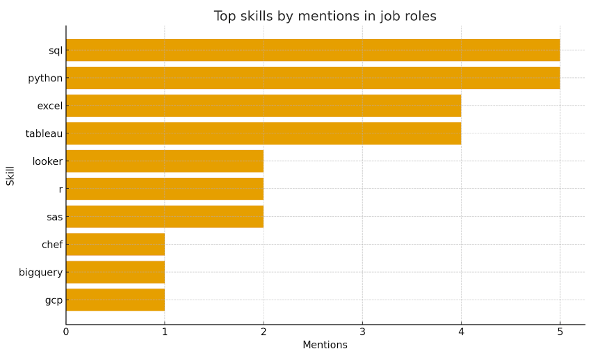
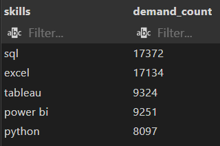
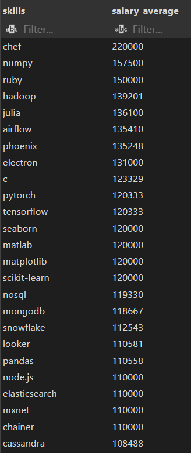
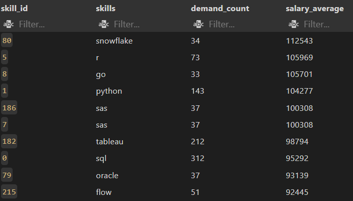

# Introduction
This project analyses the Business Analyst job market using SQL. A public US job-postings dataset is loaded into PostgreSQL and queried to answer practical questions: which roles pay the most, which skills command the highest salaries, which skills are most in demand, and where high demand and high pay overlap (the “optimal skills”). All queries are in [project_sql folder](/project_sql/), and salaries are shown in USD to reflect the source data. The aim is to provide clear, evidence-based guidance for upskilling and career focus
# Background
I built this project to navigate the Business Analyst job market more effectively and to identify where to focus upskilling. Using a public US job-postings dataset from 'Luke Barousse' SQL Course, which includes titles, skills, locations and USD salaries, I loaded the data into PostgreSQL and wrote a small set of targeted queries:

Top-paying roles – which Business Analyst job titles advertise the highest pay

Top-paying skills – average salary by skill (salary-stated postings only)

Most in-demand skills – skills with the highest frequency across postings

Optimal skills – the overlap of strong demand and high pay, with a focus on remote roles

# Tools I used
For this project, I relied on a set of core tools to manage the data, run queries, and keep everything organised:

**SQL** – the backbone of the analysis, used to query, join and aggregate the job-posting data

**PostgreSQL** – the database engine for loading the dataset and running queries (with CTEs, indexing and EXPLAIN ANALYSE where needed)

**Visual Studio Code** – editor for writing SQL, using the PostgreSQL extension to execute queries and view results

**Git & GitHub** – version control and publishing; used for branching, resolving merges and sharing the project

**Markdown** – for documenting the workflow and results in README.md
# The Analysis
Each query targets a specific part of the Business Analyst job market—top-paying roles, highest-paid skills, most in-demand skills, and the optimal overlap of demand and pay (remote, salary-stated postings); below is how I approached each

### 1. Top paying Business Analyst jobs
To surface the highest-paying roles, I filtered Business Analyst postings to those with a stated annual salary, limited the set to remote positions, and ranked job titles by average pay (USD). This highlights where the best-paid opportunities sit in the market
``` sql
SELECT
    job_id,
    job_title,
    job_location,
    job_schedule_type,
    salary_year_avg,
    job_posted_date,
    name as company_name
FROM
    job_postings_fact
LEFT JOIN company_dim on job_postings_fact.company_id = company_dim.company_id
WHERE
    job_title_short = 'Business Analyst' AND
    job_location = 'Anywhere' AND
    salary_year_avg IS NOT NULL
ORDER BY
    salary_year_avg DESC
LIMIT 10;
```
**The breakdown:**

Salary range. The top 10 remote postings span $134,550–$220,000 (USD), showing substantial earning potential

Median pay. The middle of the list sits at ≈$180,250, indicating that high six-figure salaries aren’t just outliers

Role mix. Highest salaries skew towards senior/lead/manager titles (e.g., Lead BI Engineer, Manager Analytics & Reporting, Senior/Staff/Strategy), with a few specialist roles (e.g., Applied Science, Economy Designer)

Hybrid flavour. The very top entries (>$200k) lean analytics-engineering / applied science, suggesting a premium for BA talent with strong technical depth

Remote & full-time. Every result is remote (“Anywhere”) and full-time, signalling that employers will pay top rates for distributed expertise

Business domains. Beyond core BA, high-paying roles appear in BI, revenue operations, strategy and marketing analytics, reflecting wide demand across functions


Bar chart showing the salaries for the top ten Business Analyst roles; this graphic was produced from my SQL query results with ChatGPT

## 2. Skills for top paying jobs

To pinpoint the skills behind the highest-paid Business Analyst roles, I joined the job-posting records with the skills table, revealing what employers prioritise for high-compensation positions

```sql
WITH top_paying_jobs AS (
SELECT
    job_id,
    job_title,
    salary_year_avg,
    name as company_name
FROM
    job_postings_fact
LEFT JOIN company_dim on job_postings_fact.company_id = company_dim.company_id
WHERE
    job_title_short = 'Business Analyst' AND
    job_location = 'Anywhere' AND
    salary_year_avg IS NOT NULL
ORDER BY
    salary_year_avg DESC
LIMIT 10
)

SELECT
    top_paying_jobs.*,
    skills
FROM 
    top_paying_jobs
INNER JOIN skills_job_dim ON top_paying_jobs.job_id = skills_job_dim.job_id
INNER JOIN skills_dim ON skills_job_dim.skill_id = skills_dim.skill_id
ORDER BY
    salary_year_avg DESC
```
**Breakdown from the chart (top-paying roles):**

SQL and Python jointly lead with 5 mentions each (half of the postings)

Excel and Tableau follow closely with 4 mentions apiece

Looker, R and SAS are mid-tier at 2 mentions each

Chef, BigQuery and GCP appear once—likely role/stack-specific nice-to-haves


Bar chart showing the skill counts among the top ten Business Analyst roles; this graphic was produced from my SQL query results with ChatGPT

## 3. In-demand skills for Business Analyst

This query pinpoints the skills most frequently requested across postings, highlighting where demand is strongest

```sql
SELECT
    skills,
    count(skills_job_dim.job_id) as demand_count
FROM 
    job_postings_fact
INNER JOIN skills_job_dim ON job_postings_fact.job_id = skills_job_dim.job_id
INNER JOIN skills_dim ON skills_job_dim.skill_id = skills_dim.skill_id
WHERE
    job_title_short = 'Business Analyst'
group by
    skills
ORDER BY
    demand_count DESC
LIMIT 5
```
**Breakdown — Most-requested skills for Business Analysts**

SQL and Excel are foundational – each appears in ≈17k postings (≈28% of the top-five mentions apiece), underscoring core data access and spreadsheet skills

Visualisation / BI tools are close behind – Tableau (9,324) and Power BI (9,251) account for ≈15% each, reflecting the need to communicate findings clearly

Python adds leverage – 8,097 mentions (≈13%) show growing demand for scripting to automate tasks and support deeper analysis



Table of the demand for the top 5 skills in Business Analyst job postings

## 4. Skills based on salary

By comparing average salaries across skills, I identified which skills command the highest pay

```sql
SELECT
    skills,
    round(avg(salary_year_avg), 0) as salary_average
FROM 
    job_postings_fact
INNER JOIN skills_job_dim ON job_postings_fact.job_id = skills_job_dim.job_id
INNER JOIN skills_dim ON skills_job_dim.skill_id = skills_dim.skill_id
WHERE
    job_title_short = 'Business Analyst'
    AND salary_year_avg is not null
group by
    skills
ORDER BY
    salary_average DESC
LIMIT 25
```
**Breakdown — Highest-paying skills for Business Analysts (USD)**

Python/ML stack commands a premium. Libraries such as NumPy (≈$157.5k), TensorFlow/PyTorch/scikit-learn (≈$120k) and visualisation/scientific tools (Matplotlib/Seaborn/Matlab, ≈$120k) show that analysts who can model and automate with Python earn more

Data engineering & big-data tools pay well. Hadoop (≈$139.2k) and Airflow (≈$135.4k) stand out, while modern platforms and stores—NoSQL (≈$119.3k), MongoDB (≈$118.7k), Snowflake (≈$112.5k), Elasticsearch (≈$110k), Cassandra (≈$108.5k)—also sit firmly in six-figure territory

BI & analytics platforms still matter. Looker (≈$110.6k) and Pandas (≈$110.6k) appear among the top, reflecting demand for analysts who can both prepare data and deliver insight

Engineering-leaning extras push the ceiling. General languages/frameworks (Ruby ≈$150k, Julia ≈$136.1k, C ≈$123.3k, Node.js ≈$110k) and DevOps/web items (Chef $220k, Phoenix ≈$135.2k, Electron ≈$131k) are outliers for classic BA work, but when roles blend into analytics engineering or product, salaries jump



Table of the average salary for the top 25 skills for Business Analyst

## 5. Most optimal skills to learn

By merging demand and salary signals, this query identifies skills that are both sought after and well paid—ideal targets for focused upskilling.

```sql
WITH skills_demand as (
SELECT
    skills_dim.skill_id,
    skills_dim.skills,
    count(skills_job_dim.job_id) as demand_count
FROM 
    job_postings_fact
INNER JOIN skills_job_dim ON job_postings_fact.job_id = skills_job_dim.job_id
INNER JOIN skills_dim ON skills_job_dim.skill_id = skills_dim.skill_id
WHERE
    job_title_short = 'Business Analyst'
    AND salary_year_avg is not null
group by
    skills_dim.skill_id
), salary_average as (
SELECT
    skills_job_dim.skill_id,
    round(avg(salary_year_avg), 0) as salary_average
FROM 
    job_postings_fact
INNER JOIN skills_job_dim ON job_postings_fact.job_id = skills_job_dim.job_id
INNER JOIN skills_dim ON skills_job_dim.skill_id = skills_dim.skill_id
WHERE
    job_title_short = 'Business Analyst'
    AND salary_year_avg is not null
group by
    skills_job_dim.skill_id
)

SELECT
    skills_demand.skill_id,
    skills_demand.skills,
    demand_count,
    salary_average
FROM
    skills_demand
INNER JOIN salary_average on skills_demand.skill_id = salary_average.skill_id
WHERE
    demand_count > 25
ORDER BY
     salary_average DESC,
    demand_count DESC
LIMIT 10;
```


**Breakdown — “Optimal” skills for Business Analysts (high demand × good pay)**

Cloud warehousing pays best. Snowflake tops the table at ≈$112.5k (USD) with moderate demand (34 postings), signalling strong value where BA work meets modern data platforms

Programming for analysis is a safe bet. Python combines high demand (143) with ≈$104.3k average pay — a strong all-rounder. R (≈$106.0k, 73) also performs well, especially for statistical/reporting-heavy roles

BI/visualisation drives hiring. Tableau shows very high demand (212) with ≈$98.8k pay — essential for delivering insight

SQL remains foundational. It has the highest demand (312); while the average sits lower at ≈$95.3k, it’s the entry ticket for most BA roles and pairs well with the tools above

Enterprise & pipeline skills add lift. Oracle (≈$93.1k, 37) and Airflow/Flow (≈$92.4k, 51) indicate value for analysts who can work with enterprise data stores and light pipeline orchestration

Engineering-leaning extras appear. Go (≈$105.7k, 33) shows up with strong salary but smaller demand, hinting at hybrid BA/engineering roles

# What I Learned
Advanced SQL & query design – Comfortable with joins (including many-to-many via a bridge table), CTEs, grouping/aggregation, and top-N queries with ORDER BY … LIMIT. Learned that LIMIT on grouped sets doesn’t cut compute.

Debugging & correctness – Fixed classic Postgres pitfalls (e.g., “column must appear in the GROUP BY”, stray tokens/aliases), and recovered from cancelled long-running queries by resetting the session / terminating stuck backends

Data modelling & assumptions – Worked with a fact table (job_postings_fact) and dimensions (skills_dim, skills_job_dim), filtered to remote, salary-stated roles, and combined demand + pay to identify “optimal” skills for Business Analysts

Version control in practice – Managed .gitignore, force-added previously ignored files, resolved an add/add README.md conflict, and completed a rebase before pushing to GitHub

Communication & visualisation – Turned SQL outputs into clear bar charts (PNG/SVG/PDF) and documented results concisely in the README, keeping currency explicitly in USD for a US dataset
# Conclusion

### Insights

Top-paying Business Analyst roles. Remote, full-time BA postings span $134.6k–$220k (USD), with the highest salaries skewing towards senior/lead/manager or hybrid analytics-engineering titles

Skills behind top-paying roles. The strongest signal is a hybrid toolkit: SQL + Python paired with modern platforms/BI (e.g., Snowflake/Looker/Tableau). Pipeline know-how (Airflow) appears in several high-pay roles

Most in-demand skills. Market demand is led by SQL (≈17.4k mentions) and Excel (≈17.1k), followed by Tableau (≈9.3k), Power BI (≈9.3k) and Python (≈8.1k)—a clear message that BA foundations plus one major BI tool are essential

Highest-paying skills. Premiums cluster around ML/Python libraries (NumPy, TensorFlow, PyTorch, scikit-learn ≈$120k–$158k), and data-engineering/cloud tools (Hadoop ≈$139k, Airflow ≈$135k, Snowflake ≈$112.5k). Outliers like Chef ($220k) or Ruby/Julia/C reflect dev-leaning roles rather than classic BA work

“Optimal” skills (demand × pay). The best balance comes from SQL (highest demand, ≈$95k) + Tableau (very high demand, ≈$99k), lifted by Python (≈$104k, high demand) and Snowflake (≈$112.5k, moderate demand). This mix offers broad employability with strong earning potential

Practical takeaway. For maximum market value as a Business Analyst: cement SQL + Excel, add Tableau or Power BI, then build Python for automation/modelling and cloud DWH/pipelines (e.g., Snowflake + Airflow) to reach the higher bands

### Closing Thoughts

This project strengthened my SQL skills and provided clear insight into the Business Analyst job market. The findings act as a practical guide for prioritising skill development and targeting roles. By focusing on skills that are both in high demand and well paid, aspiring Business Analysts can position themselves strongly in a competitive market. It also underscores the importance of continuous learning and adapting to new tools and platforms in business analytics